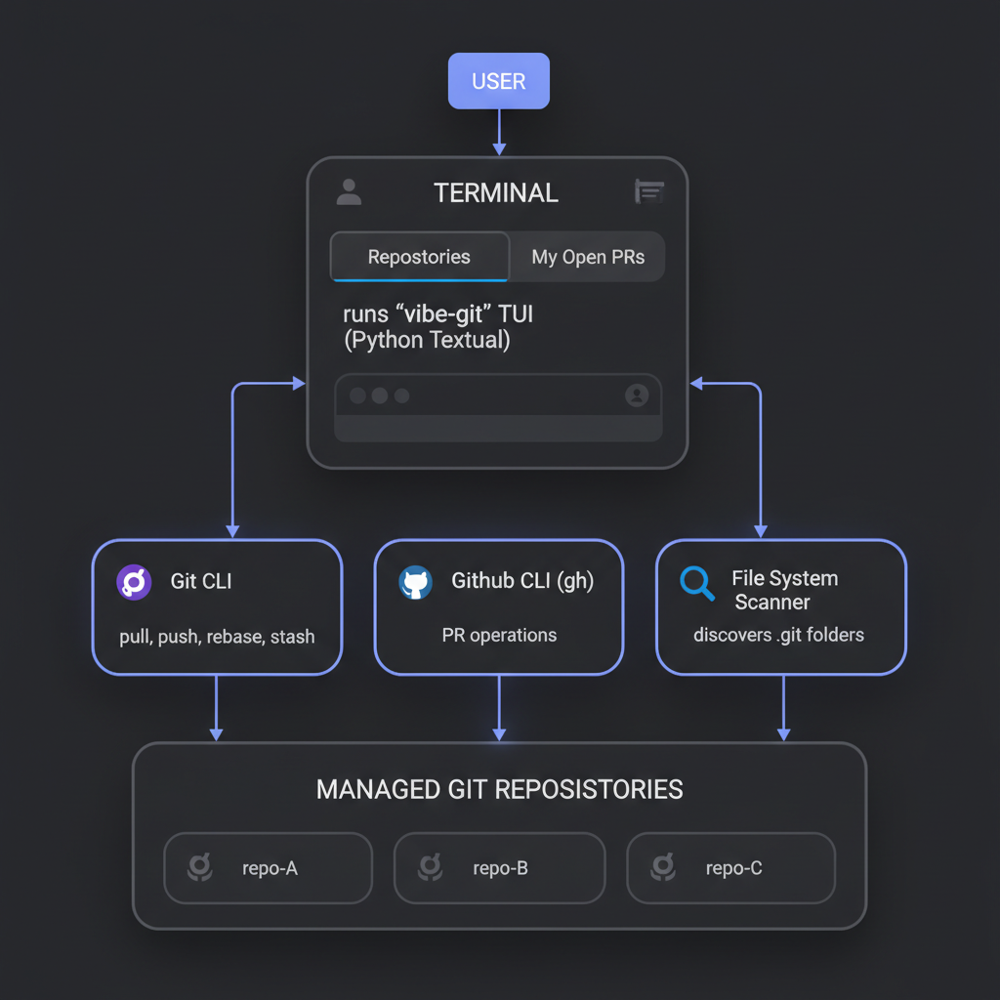

<p align="center">
  
</p>

# vibe-git

A powerful terminal UI (TUI) for managing multiple Git repositories and GitHub Pull Requests simultaneously.

<table>
<tr>
<td width="50%" align="center">
<strong>Repositories Tab</strong><br>

</td>
<td width="50%" align="center">
<strong>Pull Requests Tab</strong><br>

</td>
</tr>
</table>

## Why vibe-git?

**Built for the age of AI-assisted development.**

When you're vibe coding with tools like [Claude Code](https://docs.anthropic.com/en/docs/agents-and-tools/claude-code/overview), [OpenCode](https://github.com/opencode-ai/opencode), [Gemini CLI](https://github.com/google-gemini/gemini-cli), [Codex](https://openai.com/index/openai-codex/), or similar AI coding assistants, you often end up with multiple workstreams across different repositories and branches. Each AI session might be working on a different feature, bug fix, or experiment.

**The problem**: Keeping track of all these parallel workstreams becomes chaotic. Which branches have uncommitted changes? Which PRs are open? What needs to be pushed? What's out of sync with remote?

**vibe-git solves this** by giving you a single dashboard to:
- See the status of all your local repositories at a glance
- View all your open GitHub PRs across all repos
- Perform bulk git operations (pull, push, rebase, stash, discard)
- Checkout PRs directly to worktrees for isolated development
- Manage your git workflow without leaving the terminal

## Features

### Repository Management Tab

View and manage all Git repositories in a directory:

| Feature | Description |
|---------|-------------|
| **Status Overview** | See branch, sync status, and changes for every repo |
| **Bulk Operations** | Select multiple repos and perform actions on all at once |
| **Smart Sync Detection** | Shows if repos are ahead, behind, diverged, or in sync |
| **Worktree Support** | Detects and displays Git worktrees alongside main repos |
| **Filter/Search** | Quickly filter repos by name |

**Repository Status Indicators:**
- `Clean` - No uncommitted changes
- `Modified` - Has uncommitted changes  
- `Ahead` / `Behind` / `Diverged` - Sync status with remote
- `Local only` - No remote tracking branch
- `Needs rebase` - Behind main branch

**Keyboard Shortcuts (Repositories Tab):**

| Key | Action |
|-----|--------|
| `p` | Pull from remote |
| `r` | Rebase/Sync with main branch |
| `f` | Force push to remote |
| `c` | Create remote branch |
| `s` | Stash changes |
| `d` | Discard changes |
| `X` | Reset to remote (hard reset) |
| `D` | Delete local folder |
| `w` | Create new worktree |

### GitHub PRs Tab

View and manage all your open Pull Requests across all repositories:

| Feature | Description |
|---------|-------------|
| **Cross-Repo PR View** | See all your open PRs in one place |
| **Local Status Detection** | Shows if PR branch is checked out locally |
| **One-Click Checkout** | Checkout any PR to a worktree instantly |
| **Bulk Close** | Close multiple stale PRs at once |
| **Browser Integration** | Open PRs in browser with one key |

**PR Status Indicators:**
- `Checked out` - Branch is currently checked out locally
- `Available` - Repo exists locally, can create worktree
- `Not cloned` - Repo not present locally (will clone on checkout)

**Keyboard Shortcuts (PRs Tab):**

| Key | Action |
|-----|--------|
| `o` | Checkout PR to worktree |
| `b` | Open PR in browser |
| `C` | Close PR(s) |

### Global Shortcuts

| Key | Action |
|-----|--------|
| `Tab` | Switch between Repositories and PRs tabs |
| `Space` | Toggle selection on current row |
| `a` | Select all visible items |
| `/` | Start filtering/searching |
| `Escape` | Clear filter or selection |
| `R` | Refresh data |
| `?` | Show help |
| `q` | Quit (double-tap to confirm) |

## Requirements

### System Requirements

- **Python 3.11+**
- **Git** installed and configured
- **GitHub CLI (`gh`)** installed and authenticated (for PR features)

### Python Dependencies

```
textual>=0.50.0
```

## Installation

### Quick Start

1. Clone or download `vibe-git.py`
2. Install dependencies:
   ```bash
   pip install textual
   ```
3. Make executable (optional):
   ```bash
   chmod +x vibe-git.py
   ```
4. Run:
   ```bash
   python vibe-git.py [directory]
   ```

### GitHub CLI Setup (for PR features)

The PR tab requires the GitHub CLI to be installed and authenticated:

```bash
# Install gh (macOS)
brew install gh

# Install gh (Ubuntu/Debian)
sudo apt install gh

# Authenticate
gh auth login
```

## Usage

### Basic Usage

```bash
# Run in current directory
python vibe-git.py

# Run in specific directory
python vibe-git.py ~/projects

# Run from anywhere with alias
alias vibe='python /path/to/vibe-git.py'
vibe ~/code
```

### Typical Workflow

1. **Start vibe-git** in your projects directory
2. **Review status** of all repos on the Repositories tab
3. **Select repos** that need action (Space to select, `a` for all)
4. **Perform bulk operations** (pull, push, rebase, etc.)
5. **Switch to PRs tab** (Tab key) to see open pull requests
6. **Checkout PRs** you want to work on (`o` key)
7. **Close stale PRs** you no longer need (`C` key)

### Worktree Workflow

vibe-git creates worktrees with a flat naming convention for easy management:

```
~/projects/
├── myrepo/                    # Main repo (on main branch)
├── myrepo-feat-new-feature/   # Worktree for feature branch
├── myrepo-fix-bug-123/        # Worktree for bugfix branch
└── myrepo-experiment-ai/      # Worktree for experiment
```

This keeps all your workstreams visible and accessible without nested folder structures.

## Architecture

<p align="center">
  
</p>

**vibe-git** is built with:
- **[Textual](https://textual.textualize.io/)** - Modern Python TUI framework
- **Git CLI** - For all repository operations (pull, push, rebase, stash, etc.)
- **GitHub CLI (`gh`)** - For PR management and authentication
- **File System Scanner** - Discovers `.git` folders recursively in your project directory

## Tips for AI-Assisted Development

### Managing Multiple AI Sessions

When using multiple AI coding sessions in parallel:

1. **Use worktrees** - Each AI session can work in its own worktree
2. **Name branches descriptively** - e.g., `feat/claude-auth-system`, `fix/copilot-perf-issue`
3. **Check vibe-git frequently** - See which sessions have made progress
4. **Bulk operations** - Pull all repos before starting new sessions

### Recommended Directory Structure

```
~/ai-projects/
├── project-a/                 # Main branch
├── project-a-claude-feature/  # Claude Code working on feature
├── project-a-copilot-tests/   # Copilot writing tests
├── project-b/                 # Another project
└── project-b-codex-refactor/  # Codex refactoring
```

Run `vibe-git ~/ai-projects` to see everything at once.

## Troubleshooting

### "gh: command not found"

Install the GitHub CLI:
```bash
# macOS
brew install gh

# Ubuntu/Debian  
sudo apt install gh

# Then authenticate
gh auth login
```

### PRs not showing up

1. Ensure you're authenticated: `gh auth status`
2. PRs are fetched for the authenticated user only
3. Only open PRs are shown

### Worktree creation fails

Common causes:
- Branch already checked out elsewhere
- Branch name conflicts
- Insufficient permissions

Check the error message in the results modal for details.

## Contributing

Contributions are welcome! Please feel free to submit issues and pull requests.

## License

MIT License - see [LICENSE](LICENSE) file.

## Credits

Developed at [Shakudo](https://www.shakudo.io) - the platform for deploying and managing AI/ML infrastructure.

---

**Happy vibe coding!**
